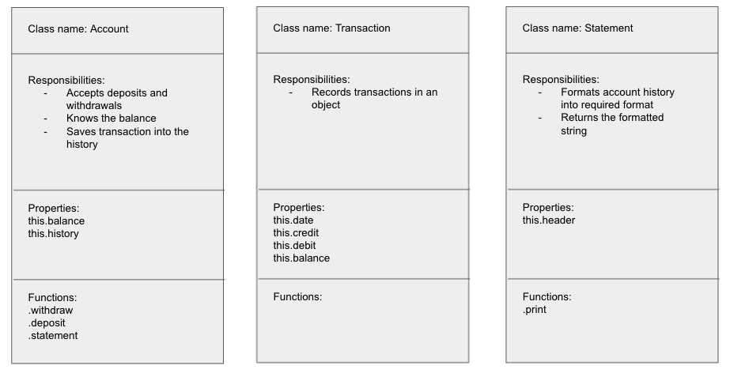
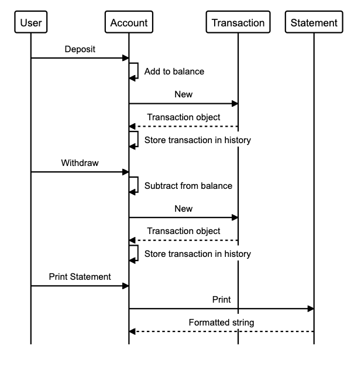
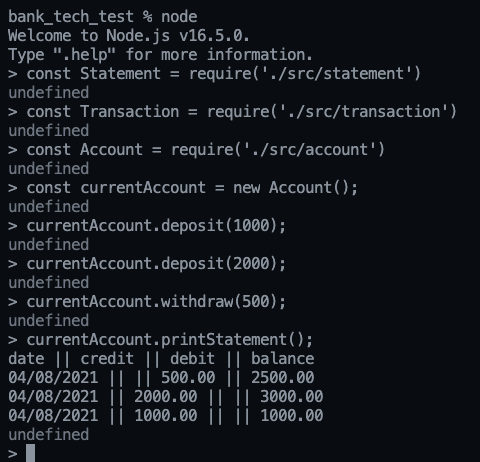

# Bank tech test

This is a mock tech test.

## Specification

### Requirements

* You should be able to interact with your code via a REPL like IRB or the JavaScript console.  (You don't need to implement a command line interface that takes input from STDIN.)
* Deposits, withdrawal.
* Account statement (date, amount, balance) printing.
* Data can be kept in memory (it doesn't need to be stored to a database or anything).

### Acceptance criteria

**Given** a client makes a deposit of 1000 on 10-01-2012  
**And** a deposit of 2000 on 13-01-2012  
**And** a withdrawal of 500 on 14-01-2012  
**When** she prints her bank statement  
**Then** she would see

```
date || credit || debit || balance
14/01/2012 || || 500.00 || 2500.00
13/01/2012 || 2000.00 || || 3000.00
10/01/2012 || 1000.00 || || 1000.00
```
## Planning

The following outlines my approach to solving the coding challenge.

#### User stories

I started this exercise by converting the program requirements into user stories for me to implement.

```
As a user,
So that I can manage my money,
I want to create a bank account.

As a user,
So that I can add to my balance,
I want to be able to make deposits. 

As a user,
So that I can use my money,
I want to be able to make withdrawls.

As a user,
So that I can track my account activity over time,
I want the date of each transaction to be recorded.

As a user,
So that I can see my account history,
I want to print an account statment. 

As a user,
So that I can see my latest transactions quickly,
I want the statement to be in reverse chronological order.

```

#### Class diagram

I then planned out what classes I would need keeping in mind object oriented principles (encapsulation, SRP, delegation).

The solution uses 3 classes with the following responsibilites:
- Account class
  - Accepts deposits and withdrawals
  - Knows the balance
  - Saves transactions into the history

- Transaction class
  - Records user transactions in an object

- Statement class
  - Formats the account history into the required format
  - Returns the formatted string



### Sequence diagram

I created a sequence diagram to show the flow of data from one class to another.



## Testing

Testing was carried out using Jest, test output below:
```
 PASS  tests/account.test.js
  Account
    ✓ starts with a balance of 0 (2 ms)
    deposit
      ✓ allows users to add to the balance (1 ms)
      ✓ throws an error if a negative number is entered (11 ms)
      ✓ creates a new transaction (1 ms)
    withdraw
      ✓ allows users to reduce the balance (3 ms)
      ✓ throws an error if balance goes below 0 (1 ms)
      ✓ throws an error if a negative number is entered
      ✓ creates a new transaction
    history
      ✓ the account starts with an empty history
      ✓ transactions are stored within the history (1 ms)
    printStatement
      ✓ the account can request a printed statement (1 ms)

 PASS  tests/feature.test.js
  Feature test
    ✓ users can create an empty bank account (1 ms)
    ✓ users can make deposits (1 ms)
    ✓ users can make withdrawls
    ✓ the date associated with a transaction is recorded (1 ms)
    ✓ users can request a statement (16 ms)

 PASS  tests/statement.test.js
  Statement
    ✓ it can display the statement header with no history (1 ms)
    for one transaction
      ✓ it can display a credit (1 ms)
      ✓ it can display a debit (1 ms)
      ✓ it can display the balance
    for multiple transactions
      ✓ it shows the transactions in reverse chronological order (1 ms)

 PASS  tests/transaction.test.js
  Transaction
    ✓ it records the date
    ✓ it records deposits (1 ms)
    ✓ it records withdrawls
    ✓ it records the balance (1 ms)

----------------|---------|----------|---------|---------|-------------------
File            | % Stmts | % Branch | % Funcs | % Lines | Uncovered Line #s 
----------------|---------|----------|---------|---------|-------------------
All files       |     100 |      100 |     100 |     100 |                   
 account.js     |     100 |      100 |     100 |     100 |                   
 statement.js   |     100 |      100 |     100 |     100 |                   
 transaction.js |     100 |      100 |     100 |     100 |                   
----------------|---------|----------|---------|---------|-------------------

Test Suites: 4 passed, 4 total
Tests:       25 passed, 25 total
Snapshots:   0 total
Time:        0.461 s, estimated 1 s
Ran all test suites.
```
Evidence of passing the acceptance test:



## How to use

This project requires Node.js to be installed on your computer. Please see their website [here](https://nodejs.org/en/) on how to install.

Clone this repo to your computer, navigate to the root directory in the terminal and enter the following to install dependancies:

```
npm install
```

To use the account, enter the node REPL and import the classes as follows:

```
> const Statement = require('./src/statement')
undefined
> const Transaction = require('./src/transaction')
undefined
> const Account = require('./src/account')
undefined
```

Create a new account with the following command:

```
const currentAccount = new Account();
```

The account accepts deposits with the .deposit method:

```
> currentAccount.deposit(1000);
```

The account accepts withdrawls with the .withdraw method:

```
> currentAccount.withdraw(500);
```

The account will print a statement with the .printStatement() method.

#### To run the tests

Enter the following in the CLI:

```
npm run test
```

